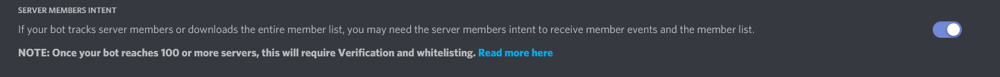

# GoGuardian ™️ the only way to truly protect your server against people like me


# Setup GoGuardian database:

[How to setup a mongoDB server on windows 10](https://youtu.be/ABAOvvBh99w)

[How to setup a mongoDB server on linux (Ubuntu)](https://youtu.be/JTvGImRESzg)

```YAML
First, setup a mongoDB database

After you're in the mongoDB shell (followed the tutorials above)

Run these commands:
```
```javascript

use Bot
db.whitelist.insertOne({useless: "github.com/Not-Cyrus"})
```

# MAKE SURE your bot has this intent (or it will not work):

# Now you're done! Either use the binaries or build it yourself, it's up to you.

# So, you want to build it yourself?

You will need these dependencies:

```YAML
https://golang.org/dl/ - download this 
go get github.com/bwmarrin/discordgo@v0.22.0 - command line
go get go.mongodb.org/mongo-driver - command line
```

After you've installed the dependencies, you are good to run this command:

```YAML
cd (directory of the main.go file)

go build -ldflags "-s -w"

(you are also welcome to run it straight from the go file.)

go run main.go
```


# General help

```YAML
Q: What is a token?
A: A token is an authentication "ticket" that allows the bot to function.

Q: How do I make a bot/How do I get it's token?
A: Go Here https://discord.com/developers/applications then create an application (if you don't know how use youtube.)

Q: What is this bot?
A: This is a bot that protects your server from being "nuked"/"wizzed"

Q: Why is the setup so complex?
A: Due to the database that is used, Complex setup | Easier to read code (kinda my codes pretty bad)

Q: Why do I need to specify the amount of shards and what are they?
A: Simple answer, more servers your bot is in the more shards you need.
For example, the live bot that's currently running this code has 29 shards and is in 800+ guilds (as of 26/02/2021)

Q: What is the recommended amount of shards?
A: Unless you're using this for hundreds of guilds, It's safe to use 1.


If you have any other questions, Make an issue at https://github.com/Not-Cyrus/GoGuardian/issues (I would link my discord, but they like to ban me very often.)
```
